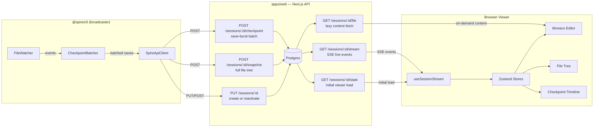
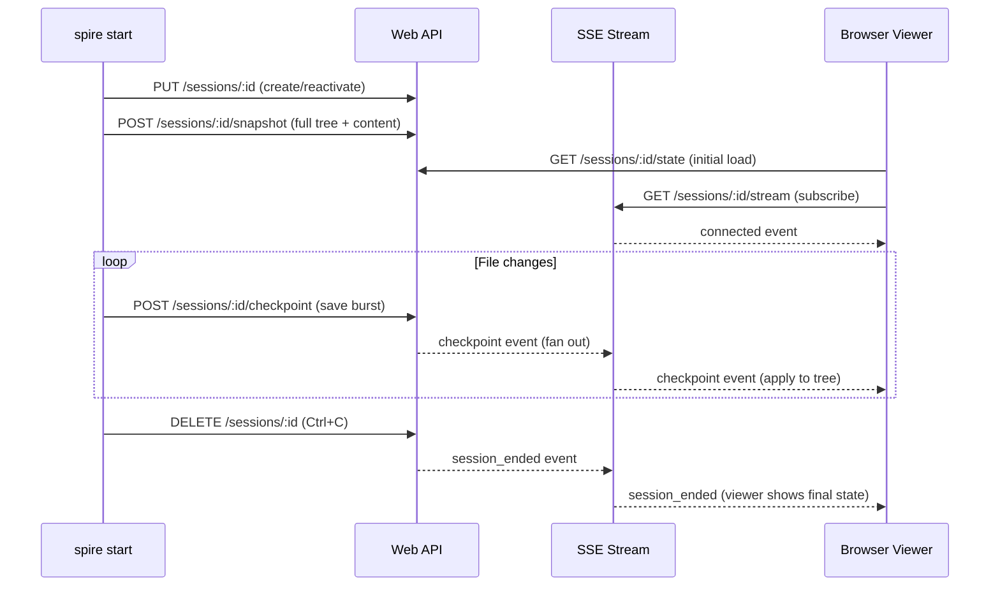

# Spire

Real-time code sharing, zero accounts required. Run the CLI to broadcast a local directory; share the URL; anyone watching sees every file change live.

## Architecture



## Session Lifecycle



## Resumable Sessions

The session ID is stored in `~/.spire/sessions.json` keyed by directory. Re-running `spire start` in the same folder reactivates the same session and re-uploads a fresh snapshot — so crashed CLIs, server restarts, and dropped connections all recover with the same share URL and unbroken history.

## Workspace

| Package | Description |
|---------|-------------|
| `apps/web` | Next.js 16 — landing page, session viewer UI, REST + SSE API |
| `apps/cli` | Node.js CLI (`@spire/cli`) — file watcher, snapshot, checkpoint batching |
| `packages/types` | Zod schemas, TypeScript types, and file-identity utilities (`HASH_RE`, `isValidHash`, `baseName`) shared across the monorepo |
| `packages/stores` | Zustand stores for the web viewer (file tree, history, editor, theme) |
| `packages/db` | Drizzle ORM schema and typed queries (Neon/Postgres) |
| `packages/eslint-config` | Shared ESLint flat configs |
| `packages/typescript-config` | Shared TypeScript configs |

## Getting Started

```sh
pnpm install
pnpm dev          # run the web app dev server
pnpm build        # build all workspaces
pnpm check-types  # type-check all workspaces
pnpm lint         # lint all workspaces
```

## Running a Session

1. Start the web app: `pnpm dev` (serves on `http://localhost:3000`).
2. In a second terminal, broadcast a directory:
   ```sh
   pnpm --filter @spire/cli dev start --dir <path> --title "My session"
   ```
3. The CLI prints a share URL — `http://localhost:3000/session/<id>`. Share it.
4. To resume after a disconnect, re-run the same command in the same directory.

> The CLI defaults to `http://localhost:3000`. Override with `SPIRE_API_URL`.

## Design Notes

- **No authentication** — the session ID is the credential. Spire is intentionally ephemeral.
- **Content-addressed storage** — file content is stored as SHA-256 blobs, deduplicated per session. Re-saving a file to a prior state costs nothing.
- **Eager / lazy mode** — sessions under ~1.5 MB / 400 files ship all content up front for instant opens; larger sessions serve content per-file on demand. Thresholds are tunable via `SPIRE_EAGER_MAX_BYTES` and `SPIRE_EAGER_MAX_FILES` env vars on the web server.
- **In-process pub/sub** — live events are fanned out in-memory; no external message broker is required.
