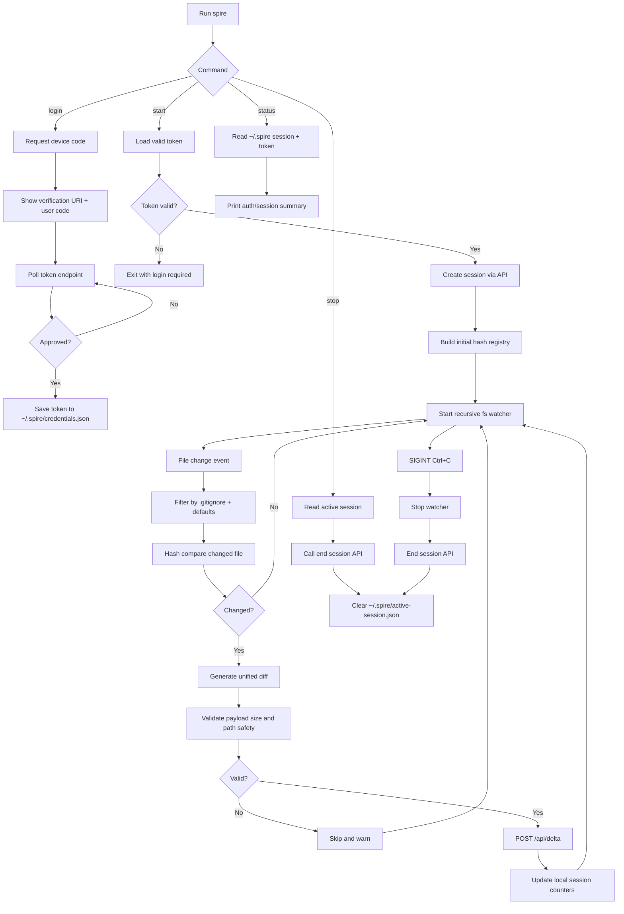

# @spire/cli

Node.js CLI for Spire instructor sessions.

## What It Does

- Authenticates the instructor with device flow.
- Creates a live session.
- Watches local files.
- Builds and validates diffs.
- Pushes deltas to Spire API.
- Persists local auth/session state under `~/.spire`.

## Command Surface

- `spire login`
- `spire start --dir <path> --title <session-title>`
- `spire status`
- `spire stop`

## End-to-End Flow

## Runtime Modules

- `src/index.ts`: command dispatch and prompt UX.
- `src/commands/*`: `login`, `start`, `status`, `stop` orchestration.
- `src/auth/device-flow.ts`: polling-based device auth flow.
- `src/auth/token-store.ts`: token persistence and expiry checks.
- `src/api/client.ts`: typed HTTP client for auth/session/delta APIs.
- `src/watcher/*`: recursive watch, filtering, and hashing.
- `src/diff/*`: unified diff generation and payload safety validation.
- `src/session/local-session.ts`: active session state persistence.
- `src/config.ts`: env and path helpers.

## Local State Files

- `~/.spire/credentials.json`: bearer token and expiration metadata.
- `~/.spire/active-session.json`: current active session tracking.

## Notes

- Designed for Node.js `>=18`.
- Uses `@clack/prompts` for CLI UX.
- Delta payload validator rejects unsafe paths and payloads larger than 50MB.
