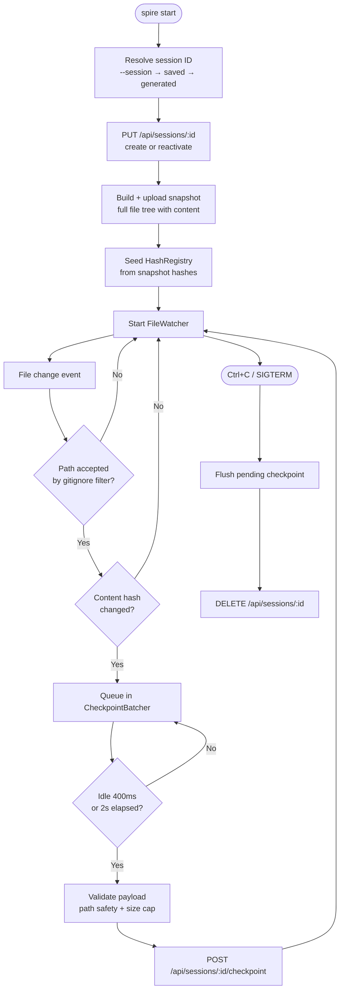

# @spire/cli

Node.js CLI for Spire — broadcast a local directory so others can watch it live in real time. No accounts or sign-in; the session ID is the share link.

## Commands

```
spire start [--dir <path>] [--title <text>] [--session <id>]
spire status
spire stop
```

Commands are auto-discovered from `src/commands/*.ts` — add a file that exports a default `CommandModule` and it appears in both the argv parser and the interactive prompt without manual registration.

## Broadcast Lifecycle



## Session ID Resolution

`spire start` resolves the session ID in priority order:

1. `--session <id>` flag (explicit override).
2. ID saved for this directory in `~/.spire/sessions.json` → **rejoin** the existing URL.
3. Freshly generated 8-character base36 ID, then saved for this directory.

Because local files are always the source of truth, every `start` re-uploads a fresh snapshot. Crashes, server restarts, and dropped connections recover by re-running the same command.

## Module Map

| Module | Responsibility |
|--------|----------------|
| `src/index.ts` | Entry point, command dispatch, interactive prompt |
| `src/commands/handler.ts` | Auto-discovery, option parsing, command dispatch |
| `src/commands/start.ts` | Full broadcast lifecycle |
| `src/commands/status.ts` | Print session info for the current directory |
| `src/commands/stop.ts` | Gracefully end a session via the API |
| `src/api/client.ts` | Typed HTTP client for all session API endpoints |
| `src/watcher/fs-watcher.ts` | Chokidar-backed recursive file watcher |
| `src/watcher/checkpoint-batcher.ts` | Idle + max-wait debounce for checkpoint batching |
| `src/watcher/gitignore-filter.ts` | Path acceptance against `.gitignore` + default excludes |
| `src/watcher/hash-registry.ts` | SHA-256 per-file hash registry for change detection |
| `src/watcher/binary.ts` | NUL-byte heuristic for binary file detection |
| `src/diff/payload-validator.ts` | Path-traversal guard and per-entry size cap |
| `src/session/local-session.ts` | `~/.spire/sessions.json` read/write |
| `src/config.ts` | Environment variables, path helpers, size constants |

## Local State

`~/.spire/sessions.json` — registry of sessions keyed by absolute directory path. Enables the sticky session ID that makes a project's share URL permanent across CLI restarts.

## Environment Variables

| Variable | Default | Description |
|----------|---------|-------------|
| `SPIRE_API_URL` | `http://localhost:3000` | API server base URL |
| `API_BASE_URL` | `http://localhost:3000` | Fallback (lower precedence than `SPIRE_API_URL`) |
