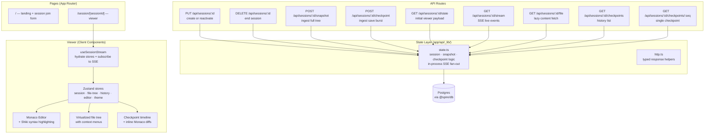
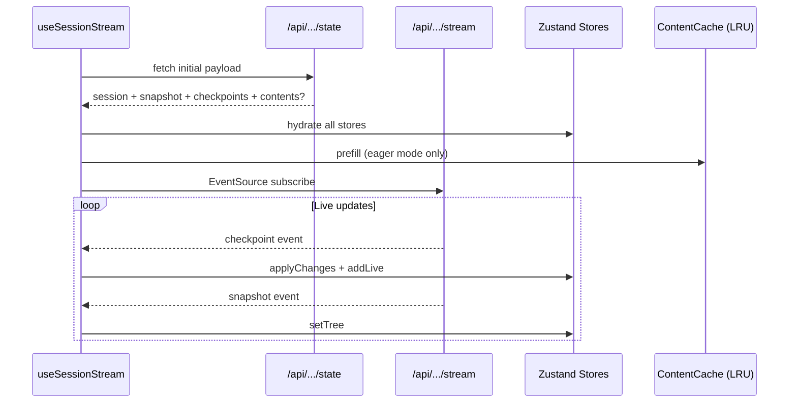

# apps/web

Next.js 16 application serving the Spire landing page, session viewer UI, and the REST + SSE API consumed by both the CLI broadcaster and browser viewers.

## Architecture

## Viewer Data Flow

## Key Files

| Path | Description |
|------|-------------|
| `src/app/api/_lib/state.ts` | Core session/snapshot/checkpoint business logic + SSE pub/sub |
| `src/app/api/_lib/http.ts` | `success` / `failure` / `readJsonBody` response helpers |
| `src/app/session/[sessionId]/session-viewer.tsx` | Top-level viewer layout (panels, status bar, quick-open) |
| `src/app/session/[sessionId]/file-tree.tsx` | Virtualized file tree with context menus |
| `src/app/session/[sessionId]/code-viewer.tsx` | Monaco tabs, diff mode, breadcrumbs |
| `src/app/session/[sessionId]/history-panel.tsx` | Checkpoint timeline with inline Monaco diffs |
| `src/components/monaco-viewer.tsx` | Monaco viewer and diff-viewer wrappers |
| `src/lib/use-session-stream.ts` | Store hydration + SSE subscription hook |
| `src/lib/use-file-content.ts` | Cache-first file content hook with hover prefetch |
| `src/lib/content-cache.ts` | Content-addressed LRU cache (~120 entries / ~12 MB) |
| `src/lib/session-api.ts` | Typed fetch helpers for all viewer-side API calls |

## Environment Variables

| Variable | Required | Description |
|----------|----------|-------------|
| `DATABASE_URL` | Yes | Neon/Postgres connection string |
| `SPIRE_EAGER_MAX_BYTES` | No | Max total session size for eager mode (default: 1.5 MB) |
| `SPIRE_EAGER_MAX_FILES` | No | Max file count for eager mode (default: 400) |
